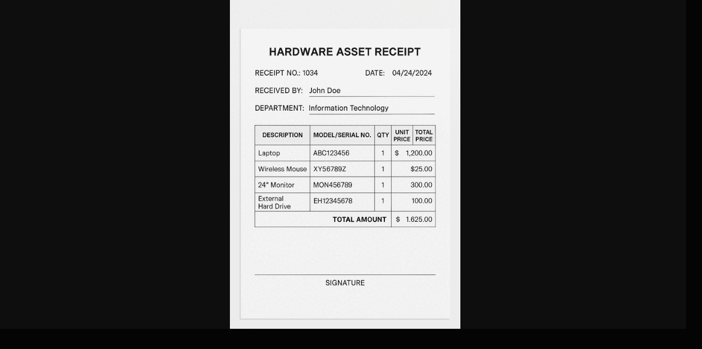

# Local OCR using Ollama's Gamma3

An app that performs OCR (Optical Character Recognition) and Markdown formatting using the Gemma 3 (12B) large language model via Ollama. Upload an image, and the app will extract the text and return a clean, structured, and readable Markdown representation.

---

## 🚀 Features

- Upload image files **(JPG, JPEG, PNG)**
- Perform OCR with ***Gemma 3 (12B)*** through the Ollama
  - Formats the extracted text into ***Markdown*** (headings, lists, code blocks, etc.)
- Runs completely offline (once Ollama and models are installed)

---

## 📸 Demo

---

## 🧩 Requirements

- Python 3.9+
- [Ollama](https://ollama.com) installed and running locally
- Pull `gemma3:12b` model in Ollama
---

## 🛠️ Installation

- Clone this repository
`git clone https://github.com/vivekdeshmukhrepos/ocr_using_gamma3.git`
 
- Install dependencies
`pip install -r requirements.txt`

- Run the app
 `streamlit run app.py`

## ⚙️ Configuration
If Ollama is hosted on a different address or port, modify this section in `app.py`

`return Client(host='http://localhost:11434')`